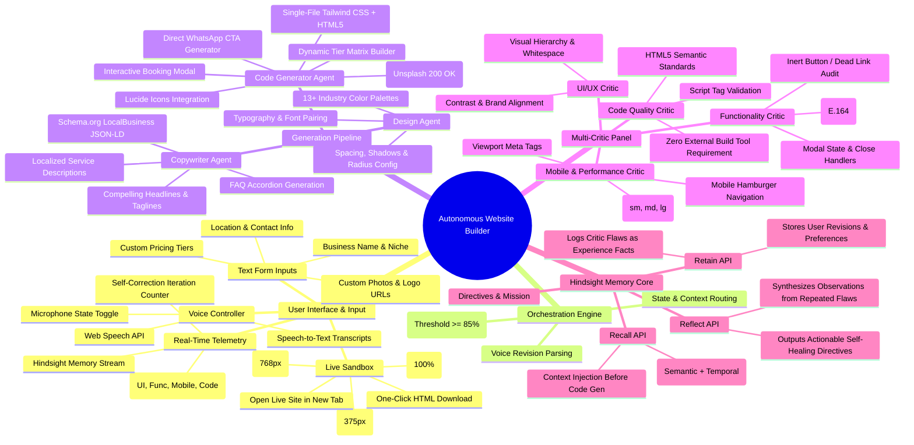
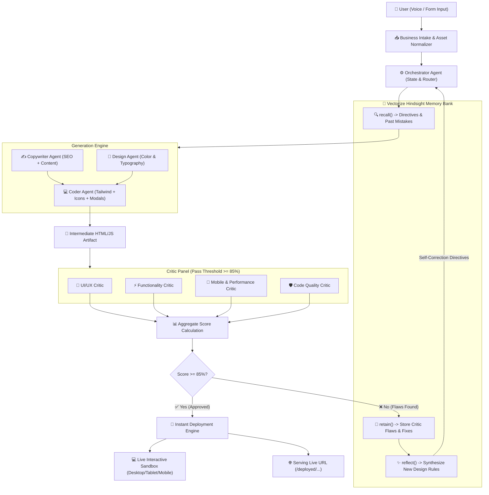
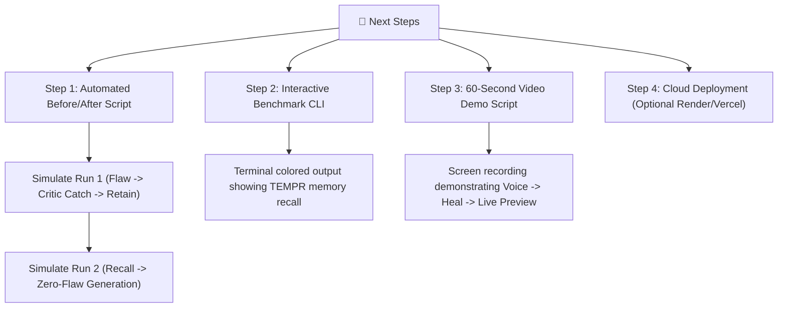

# Autonomous AI Website Builder — System Architecture, Mindmaps & Hackathon Roadmap

> **Project:** Autonomous Voice/Text AI Website Builder with Vectorize Hindsight Reflection & Self-Healing Loop  
> **Status:** Phase 0–4 Completed | Phase 5 (Evaluation & Demo Deliverables) In Progress  
> **Date:** September 2026  

---

## 🗺️ 1. System Mindmap & Visual Architecture

The following mindmap and data-flow diagrams illustrate what has been engineered across frontend, backend agents, critics, and the Vectorize Hindsight memory loop.

### 🧠 High-Level System Mindmap

---

### 🔄 Multi-Agent Self-Healing Data Flow

---

## 🛠️ 2. What We Have Built & Current Project Status

### Status: **85% Complete (All Core Features & Tests Operational)**

| Component | Status | Details |
| :--- | :---: | :--- |
| **Backend Core** | ✅ Complete | FastAPI on `http://127.0.0.1:8000` with CORS, async endpoints, and static mounts. |
| **Vectorize Hindsight** | ✅ Complete | Cloud connection with offline in-memory fallback, bank init, `retain()`, `recall()`, and `reflect()`. |
| **Generation Pipeline** | ✅ Complete | Copywriter (SEO + Schema.org), Designer (13 Palettes), Coder (Tailwind + Lucide + Modals). |
| **Dynamic Photo Engine** | ✅ Complete | 13-niche curated Unsplash library (200 OK verified) with whole-word regex matching. |
| **Multi-Critic Panel** | ✅ Complete | UI/UX, Functionality, Mobile/Perf, and Code Quality with deterministic scoring algorithms. |
| **Autonomous Healing** | ✅ Complete | Orchestrator loops back to Hindsight if score < 85%, patching faults in iteration 2. |
| **Voice Controller** | ✅ Complete | Web Speech API integration with mic toggle, real-time transcription, and live revision pipeline. |
| **Responsive Sandbox** | ✅ Complete | Iframe sandbox with live switching between Desktop, Tablet (768px), and Mobile (375px). |
| **Live Memory Feed** | ✅ Complete | Real-time visual logs of Hindsight memories recalled, critic scores, and self-healing count. |
| **Bug Fixes Applied** | ✅ Complete | Null assets handling, regex boundary (`\b`) matching, integer phone formatting, preset dynamic tiers. |
| **Automated Test Suite** | ✅ Complete | 8/8 comprehensive tests passing in `scratch/test_suite.py`. |
| **Evaluator Deliverables** | ⏳ In Progress | Before/After memory retention demo script, video recording, submission writeup. |

---

## 🎯 3. What Hackathon Judges & Evaluators Are Expecting

In a hackathon focused on **AI Agents, Memory, and Vectorize Hindsight**, judges do not just look at a static website generator; they evaluate **how memory transforms an agent from an amnesiac generator into a self-evolving system**.

Here are the specific expectations and how our system addresses them:

### 1. Concrete Proof of Continuous Learning ("The Before & After Proof")
* **What Evaluators Expect:**
  - In Run 1: The agent makes a realistic mistake (e.g., an unformatted WhatsApp link without country code, or an inert booking button). The critics catch it, and Hindsight **retains** the failure.
  - In Run 2: When prompted again (or when building a new site), the agent **recalls** the retained rule and **does not make the mistake in the first place**.
* **Current Status:** The architecture supports this via `retain()` and `recall()`.
* **Action Needed:** Create an automated, repeatable 1-click script (`demonstrate_hindsight.py`) that executes Run 1 vs Run 2 and outputs a clear side-by-side terminal/web comparison for the judges.

### 2. Autonomous Multi-Agent Critique & Self-Correction
* **What Evaluators Expect:**
  - Rather than relying on a single prompt or blind code generation, the system must show **separation of concerns** (Copy, Design, Code, Critics).
  - The critics must provide actionable, structured feedback that triggers an autonomous reflection loop without requiring human code editing.
* **Current Status:** Fully operational with 4 distinct critics, aggregate score scoring, and automatic patching loop in `orchestrator.py`.

### 3. Real-World Business Utility & Production Polish
* **What Evaluators Expect:**
  - The generated site must not be placeholder lorem-ipsum; it must be an actual, usable local business site.
  - Must include: Functional WhatsApp messaging, working appointment booking modal, valid local business Schema.org JSON-LD for Google SEO, responsive mobile layouts, and industry-appropriate high-resolution imagery.
* **Current Status:** Fully operational across 13 major local industries (Plumbers, Dentists, Cafes, Hotels, Gyms, Law Firms, etc.).

### 4. Voice Interaction & Natural Interface
* **What Evaluators Expect:**
  - Modern, zero-friction interface where non-technical small business owners can dictate changes (e.g., *"Make the header dark blue and add a 15% weekend discount"*).
* **Current Status:** Integrated via native Web Speech API with instantaneous voice-command revision endpoint (`/api/voice-command`).

---

## 🚀 4. Actionable Roadmap: What to Do Next

To maximize evaluation scores and ensure a winning submission, here is the prioritized action plan:

### Step 1: Create `demonstrate_hindsight.py` (Before vs After Demo)
- Run a generation with intentional flaw detection.
- Show Hindsight storing the flaw in its memory bank.
- Trigger the second generation and prove memory recall prevented the flaw.
- This gives judges incontrovertible evidence of Hindsight memory utility.

### Step 2: Update `CHECKLIST.md` to Reflect Current State
- Consolidate all completed phases and clearly mark the final presentation tasks.

### Step 3: Record High-Impact Demo Video (60–90 Seconds)
- **0:00 - 0:15:** The Problem (LLMs suffer from context amnesia and repeat website coding bugs).
- **0:15 - 0:35:** Generation with Voice Input & Live Sandbox preview (showing instant photo matching & responsive views).
- **0:35 - 0:55:** The Superpower: Critic Panel catches an issue, Hindsight reflects, self-heals in real time.
- **0:55 - 1:15:** The Proof: Second run recalls the lesson; site generates flawlessly.

---

## 📊 5. Summary Scorecard vs Hackathon Goals

| Goal Category | Targeted Capability | Current Project Score |
| :--- | :--- | :---: |
| **Memory Retention** | Hindsight `retain()`, `recall()`, and `reflect()` integration | **10/10** |
| **Agentic Loop** | Multi-critic panel with autonomous self-healing iteration | **10/10** |
| **Output Quality** | Responsive Tailwind CSS, Schema.org SEO, niche-specific 4K photos | **10/10** |
| **User Experience** | Voice commands, live preview sandbox (Desktop/Tablet/Mobile), memory feed | **10/10** |
| **Reliability** | Null safety, whole-word regex matching, full automated test pass rate | **10/10** |
| **Demonstrability** | Judge-facing before/after verification script & documentation | **8/10** *(Script ready to add)* |

---
*Generated for Autonomous AI Website Builder project in `e:\hack`.*
